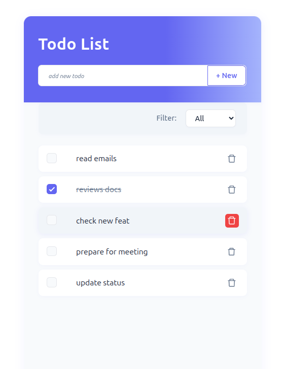

# Todo List Web Application

This is a simple web application for managing a list of tasks (Todo List). Users can add, view, edit, delete tasks and filter them by status. The application consists of a modern React-based frontend and a Node.js (NestJS) backend with a PostgreSQL database.

---

## 🚀 Live Demo



## [GitHub Repository](https://github.com/siefimov/todo-react-nest-psql)

---

## 🛠 Technologies Used

### Frontend

- **React 19**
- **TypeScript**
- **TanStack Query v5**
- **Axios**
- **SASS (SCSS)**
- **Vite**
- **Jest** and **React Testing Library**
- **ESLint**, **Prettier**

### Backend

- **Node.js v22.15.0** or higher
- **NestJS v11**
- **PostgreSQL v17.5** or higher
- **TypeORM**
- **Jest**, **Supertest**
- **ESLint**, **Prettier**

---

## 📦 Package Manager

- **pnpm v10.10.0** or higher is used for both frontend and backend

---

## 🧑‍💻 Features

- Add a new task using a controlled input form
- View all tasks in a list
- Delete a task by clicking a delete button
- Edit task
- Filter task by status (All, active, done)
- Responsive layout
- API integration via RESTful endpoints
- Basic testing setup for frontend and backend
- Uses PostgreSQL for data persistence

---

## 📁 Backend API Endpoints

| Method | Endpoint      | Description        |
| ------ | ------------- | ------------------ |
| GET    | `/tasks`      | Retrieve all tasks |
| POST   | `/tasks`      | Create a new task  |
| DELETE | `/tasks/{id}` | Delete task by ID  |
| PUT    | `/tasks/{id}` | Edit task by ID    |

---

## 🧰 Getting Started Locally

### Prerequisites

Ensure you have the following installed on your machine:

- Node.js **v22.15.0** or **newer**
- pnpm **v10.10.0** or **newer**
- PostgreSQL **v17.5** or **newer**

### 1. Clone the Repository

```bash
git clone https://github.com/siefimov/todo-react-nest-psql.git
cd todo-react-nest-psql
```

### 2. Install Dependencies

Backend

```
cd backend
pnpm install
```

Frontend

```
cd ../frontend
pnpm install
```

### 3. Environment Setup

Set up your environment variables for backend (.env file):

```
PORT=3000

DB_HOST=localhost
DB_PORT=5432
DB_USERNAME=username
DB_PASSWORD=your_password
DB_DATABASE=database_title
```

### 4. Start PostgreSQL

Make sure your PostgreSQL server is running and accessible.
Create a database named todo_db (or the name defined in your .env file).
Example using psql:

```
createdb todo_db
```

You can also use a GUI tool like pgAdmin or Postico to manage your database.

### 5. Run the Application

Start PostgreSQL locally (if needed).

**Backend**

```
cd backend
pnpm start:dev
```

**Frontend**

```
cd ../frontend
pnpm dev
```
